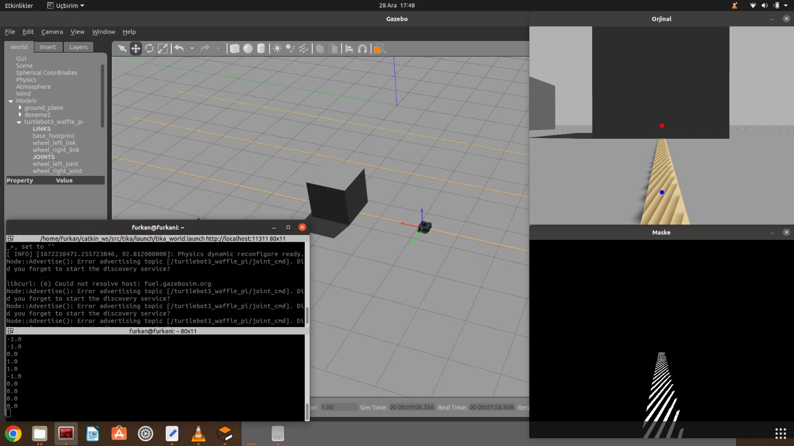
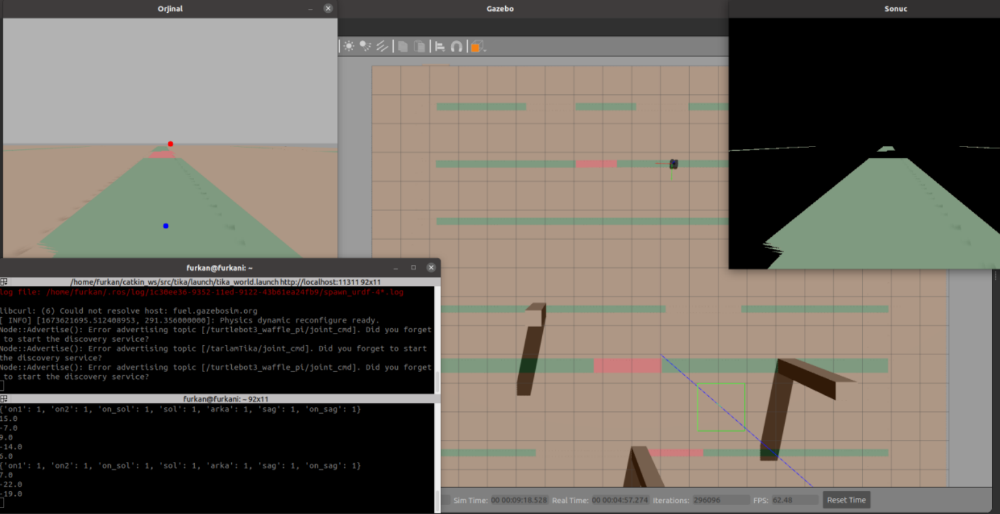

# Agricultural Unmanned Ground Vehicles Design
Tarımsal İnsansız Kara Araçlarında Otonom Sürüş Algoritmaları: Engellerden Kaçınma ve Otonom Yol Takibi

Yarışmadaki görev, Tarımsal insansız kara aracının zararlı otları tespit edip müdahale etmesi, parkurda önüne çıkan engellerden kaçınması ve otonom hareket kullanarak başarıyla parkuru tamamlamasıdır.

Araç, otonom sürüş için kamera, Lidar ve IMU sensörleri kullanmaktadır. Otonom yol takibi için bitkilerin ekilme sırası kullanılarak yol güzergahı oluşturulur. Araç, gmapping Simultaneous Localization and Mapping (SLAM) algoritmasını kullanarak çevresindeki ortamın haritasını oluşturur ve kendini konumlandırır.

Engellerden kaçınma için araç, Lidar sensörüyle engelleri tespit eder ve engelin etrafından dolanma algoritmasıyla hareketine devam eder. Manevra yapmak için aracın döneceği yöne ters yöndeki motora güç verilerek aracın istenilen yöne dönmesi sağlanır.

# Autonomous Driving Algorithms

Otonom sürüş algoritmalarının test edilmesi için simülasyon önemlidir. Gazebo simülasyon ortamı, sensör verilerinin işlenmesinde kolaylık sağlar. Aracın simülasyon ortamına gerçekçi bir şekilde aktarılması için Solidworks programında geliştirilen robot modeli kullanılır. Simülasyon ortamında kültür bitkileri, yabani otlar ve engeller yerleştirilerek testler gerçekleştirilir. Gazebo ve Rviz (ROS Visualization) programları, kamera ve sensör verilerinin görüntülenmesini sağlar.

Oluşturulan otonom sürüş algoritması, simülasyon ortamında entegre edilerek farklı açılar, ortamlar ve hızlarla test edilir. Testler sonucunda en doğru açılar, hızlar ve sensör konumları belirlenir. Elde edilen bilgilere göre kamera, sensörlerin konumları ve algoritmalar düzenlenir.

# CODE DESCRIPTION

Python kodu, Rota takip etme işlevini gerçekleştirmektedir. Kod, bir ROS (Robot Operating System) düğümü olarak başlatılır ve kamera ve LIDAR sensörlerinden gelen verileri kullanır.

İlk olarak, SeritTakip sınıfı tanımlanır ve __init__ yöntemi içinde ROS düğümü başlatılır, ROS mesajlarına abone olunur ve mesaj yayınlama işlevi için bir yayıncı oluşturulur.

kameraCallback yöntemi, kamera verilerini işlemek için kullanılır. Gelen kamera görüntüsü, HSV renk uzayına dönüştürülerek yeşil renk aralığını tanımlayan bir maske oluşturulur. Ardından, maskeleme işlemi uygulanmış görüntü üzerinde, yeşil renkteki nesnenin merkezini bulmak için görüntü işleme yöntemleri kullanılır. Eğer yeşil renkteki nesne bulunursa, bir hedef merkez noktası hesaplanır ve bu merkez noktasına göre bir sapma hesaplanır.

Sapma değeri kullanılarak, aracın hızı ve dönüş hareketi belirlenir. Eğer nesne merkezden uzaksa, araç hedefe doğru hareket eder ve sapma miktarına bağlı olarak dönüş yapar. Ayrıca, LIDAR sensöründen gelen veriler de kullanılarak, aracın önünde engel olup olmadığı kontrol edilir. Engellerden kaçınmak için araç hızı ve dönüş hareketi ayarlanır.

Kodda, yayıncı aracılığıyla hız ve dönüş hareketi komutları yayınlanır ve aracın hareket etmesi sağlanır. Ayrıca, görüntü işlem sonuçları da görüntülenir.
